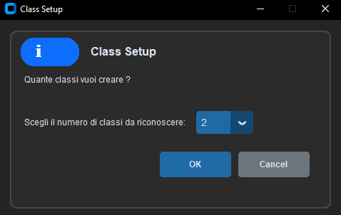
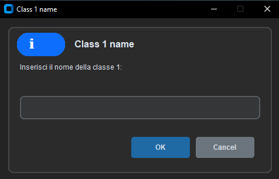

  
    
  <i>Camera Classifier with live video feed, 
  custom Tkinter GUI, and CNN model trained on user images.</i>

---

# 📖 Index

* 📌 [Overview](#-overview)
* 📥 [Download & Installation](#-download--installation)
* 📷 [Usage Examples](#-usage-examples)
* 📄 [License](#-license)

---

# 📌 Overview

**Camera Classifier** is a **Python application** that allows users to capture images from a live camera, label them, train a **Convolutional Neural Network (CNN)** model, and predict classes in real-time.

The project combines **CustomTkinter GUI**, **OpenCV camera handling**, and a **CNN built with TensorFlow/Keras**, providing a full interactive experience for image classification.

Key features:

1. **Custom class setup**: The user chooses the number of classes (2–10) and their names.
2. **Image collection**: Capture images for each class via live camera feed.
3. **CNN training**: Images are preprocessed and augmented; the model trains with early stopping for robust results.
4. **Real-time prediction**: Predicts class of live frames with optional automatic prediction mode.
5. **Reset functionality**: Clears the model and saved images to start fresh.

This tool is ideal for small-scale image classification experiments, live demonstrations, and learning CNN fundamentals.

---

# 📥 Download & Installation

**⚠️ Python 3.x is required on the machine to run this project.**

1. Download the latest CameraClassifier folder (includes all files and the batch file).
2. Make sure Python 3.x is installed and added to your system PATH.
3. Open the folder and double-click run_camera_classifier.bat to start the application.
On first run, the batch file will install the required Python packages (from requirements.txt). 

# 📷 Usage Examples

**Workflow:**

* The program prompts for class number and names. 
 
 
* Capture images per class using the provided buttons.
* Train the CNN model with the collected images.
* Use the "Predict" or "Auto Prediction" buttons to classify live camera feed.
* The status bar and labels display prediction results in real-time.

**Example Prediction Output:**

---

# 📄 License

Released under the MIT License.
Feel free to use, modify, and share 🚀

---

